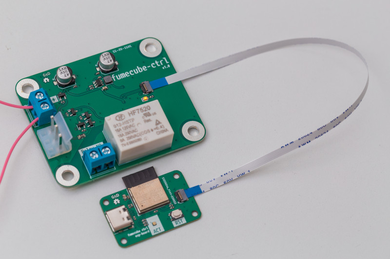

# fumecube-ctrl

A replacement controller for the Purex Fumecube, a HEPA filter based fume extractor unit.

## What

This controller replaces the existing control board and adds WiFi control using esphome based firmware.
The board runs off a 12V supply, just like the original control board, and features a relay to control the AC to the motor.

Motor enable and control signals are level shifted with mosfets and sent to the motor controller.

The device is intended to be paired with home assistant, so that a wireless switch or my phone/laptop can enable and adjust the speed of the fan.

`docs/fix-speed-controller` contains a kicad schematic of the original 555 based controller for reference. It seems like it was designed to operate off both an AC transformer and the +12V supply found in my unit.

## Why

The original control interface for the fumecube is a potentiometer on the front of the unit, which features a DPST switch that enables AC to the motor controller.
Having to dial the speed all the way done to turn the unit on/off is cumbersome. Additionally, the unit is typically placed under my desk, and leaning down to turn the unit on and off just doesn't happen all the time. 

## Features

Because the fumecube is made with a sheet metal shell, the ESP is designed on a separate PCB and should be fitted outside the unit in a small 3d printed enclosure.

## Assembled boards



## Firmware

The firmware is based on [ESPHome](https://esphome.io) 
ESPHome projects are defined using a yaml config file. The ESPHome tool then pulls in source files to compile the firmware. You can install it and then compile the firmware with the following:

```
pip install esphome
cd src
esphome compile esp-fumecube.yaml
esphome upload esp-fumecube.yaml --device /dev/ttyACM0
```


## Licence

 * Hardware in this repository is licenced under CERN OHL v1.2
